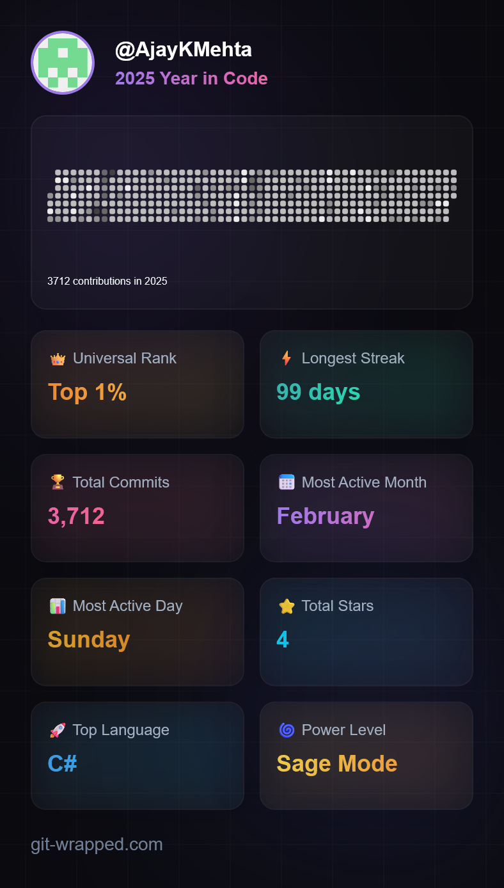
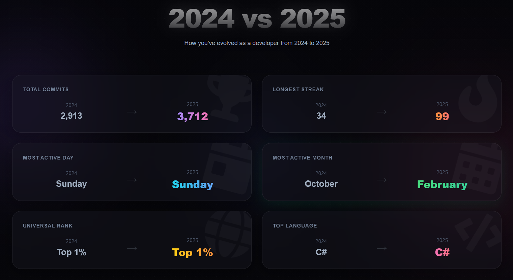

:construction: **WORK IN PROGRESS** :construction:

**Hi there 👋, I'm Ajay.**

## Stats

<picture>
  <source
    srcset="https://github.com/AjayKMehta/AjayKMehta/raw/grs/stats-dark.svg"
    media="(prefers-color-scheme: dark)"
  />
  <source
    srcset="https://github.com/AjayKMehta/AjayKMehta/raw/grs/stats-light.svg"
    media="(prefers-color-scheme: light), (prefers-color-scheme: no-preference)"
  />
  
</picture>

### 2025

## Skills and interests

### Languages

    
    <!---->

### :cloud:

### Data

### Other

## Recent activity

> [!NOTE]
> This includes activity for public repos.

<!--START_SECTION:activity-->
1. 🚀 Committed to [AjayKMehta/builderbuilder](https://github.com/AjayKMehta/builderbuilder/commit/f7752ee1d3044cdf18107bddf0fd8c6e68886491)
2. 🚀 Committed to [AjayKMehta/builderbuilder](https://github.com/AjayKMehta/builderbuilder/commit/f8cb3f7955064f5a5c8cbbfdbee2a6b6c06b1307)
3. 🚀 Committed to [AjayKMehta/setup-machine](https://github.com/AjayKMehta/setup-machine/commit/8eef5696fcbc6c5a19490dd6d936b78b35a34ccd)
4. 🚀 Committed to [AjayKMehta/AjayKMehta](https://github.com/AjayKMehta/AjayKMehta/commit/ee9ac62f9a6eb401eda52ff1eecfd264296ec20c)
5. 🚀 Committed to [AjayKMehta/setup-machine](https://github.com/AjayKMehta/setup-machine/commit/58328791a67e18812c3483aa3ee702d0ab00e6e3)
6. 🚀 Committed to [AjayKMehta/setup-machine](https://github.com/AjayKMehta/setup-machine/commit/23e72d395cde5c9d2adfa9c4a1fd7fb05a4cc789)
7. 🚀 Committed to [AjayKMehta/AjayKMehta](https://github.com/AjayKMehta/AjayKMehta/commit/97374e875fffc713b907843a20245b07a44e794f)
8. 🚀 Committed to [AjayKMehta/AjayKMehta](https://github.com/AjayKMehta/AjayKMehta/commit/42164e428b01a752f97b2763fe39d86e35f5a229)
9. 🚀 Committed to [AjayKMehta/WSL](https://github.com/AjayKMehta/WSL/commit/7154f5ef8167ff380fe5d62b6f360de1051d7ab8)
10. 🚀 Committed to [AjayKMehta/AjayKMehta](https://github.com/AjayKMehta/AjayKMehta/commit/e73f400183ae9d96e32ad3e31145aa3e67873b7f)
11. 🚀 Committed to [AjayKMehta/lefthook](https://github.com/AjayKMehta/lefthook/commit/97f48535390d0652b7849b068cd1c8541f757beb)
12. 🚀 Committed to [AjayKMehta/lefthook](https://github.com/AjayKMehta/lefthook/commit/08f34ba839f31a6a848cf998346ff17fe86f2a56)
13. 🚀 Committed to [AjayKMehta/dotfiles](https://github.com/AjayKMehta/dotfiles/commit/0420b2e5bb7bce24764102ef2ab818cfdbfa5155)
14. 🚀 Committed to [AjayKMehta/lefthook](https://github.com/AjayKMehta/lefthook/commit/aceb2ea3ef2076c43d9c160b9516590168325bd7)
15. 🚀 Committed to [AjayKMehta/builderbuilder](https://github.com/AjayKMehta/builderbuilder/commit/4a0484b51538a5a542b857359fef7a9634da6fc9)
<!--END_SECTION:activity-->
