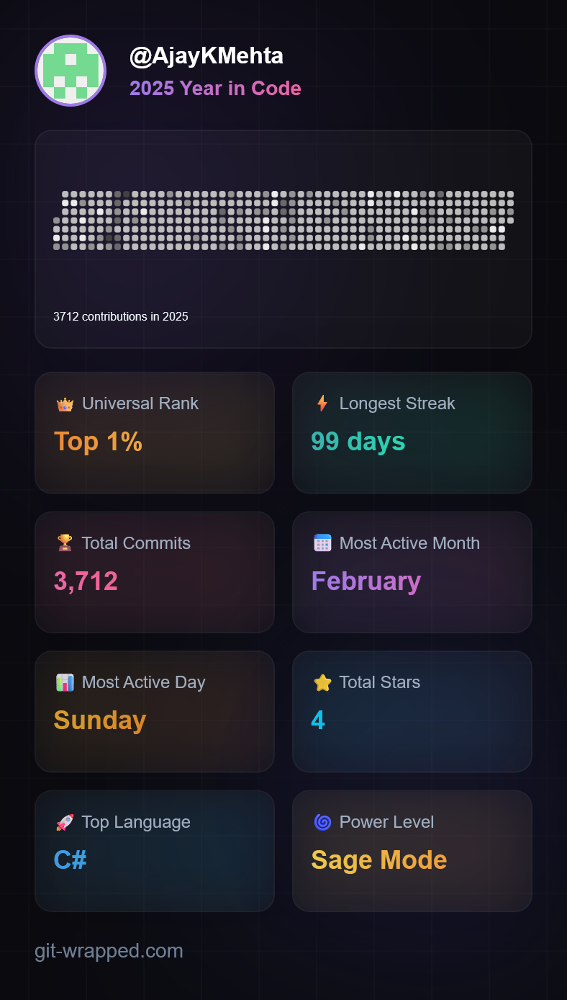
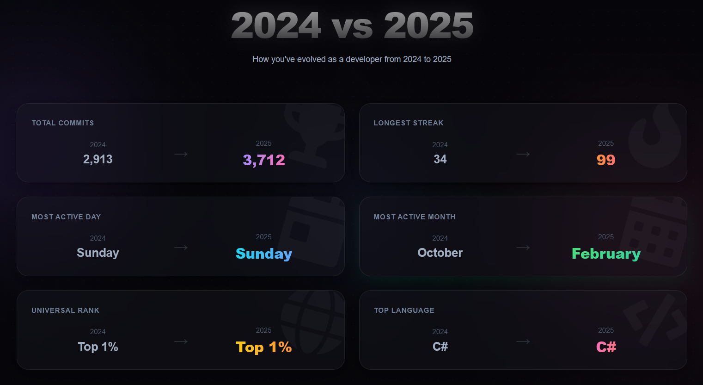

:construction: **WORK IN PROGRESS** :construction:

**Hi there 👋, I'm Ajay.**

## Stats

<picture>
  <source
    srcset="https://github.com/AjayKMehta/AjayKMehta/raw/grs/stats-dark.svg"
    media="(prefers-color-scheme: dark)"
  />
  <source
    srcset="https://github.com/AjayKMehta/AjayKMehta/raw/grs/stats-light.svg"
    media="(prefers-color-scheme: light), (prefers-color-scheme: no-preference)"
  />
  
</picture>

### 2025

## Skills and interests

### Languages

    
    <!---->

### :cloud:

### Data

### Other

## Recent activity

<!--START_SECTION:activity-->
1. 🚀 Committed to main in [AjayKMehta/setup-machine](https://github.com/AjayKMehta/setup-machine/commit/8b02662976d0550b12aa5218c05038657fe64343)
2. 🚀 Committed to main in [AjayKMehta/WSL](https://github.com/AjayKMehta/WSL/commit/90029db33ce16878ca4a77d7b02e9f631890dbd3)
3. 👤 Assigned issue #208 in [HiPhish/rainbow-delimiters.nvim](https://github.com/HiPhish/rainbow-delimiters.nvim/issues/208)
4. 🏷️ Added a label to issue #208 in [HiPhish/rainbow-delimiters.nvim](https://github.com/HiPhish/rainbow-delimiters.nvim/issues/208)
5. ❗ Opened issue #208 in [HiPhish/rainbow-delimiters.nvim](https://github.com/HiPhish/rainbow-delimiters.nvim/issues/208)
6. 🚀 Committed to master in [AjayKMehta/PowerShellScripts](https://github.com/AjayKMehta/PowerShellScripts/commit/3a647dc23b113dfbd1da2427718de3594a96e026)
7. 🚀 Committed to main in [AjayKMehta/setup-machine](https://github.com/AjayKMehta/setup-machine/commit/a6f3d15f9c9bb9b26303babd0583f0e03907e303)
8. 🚀 Committed to main in [AjayKMehta/WSL](https://github.com/AjayKMehta/WSL/commit/8bd5d36074af6196c0d5fc055b4e45cc06a29ec4)
9. 🚀 Committed to main in [AjayKMehta/WSL](https://github.com/AjayKMehta/WSL/commit/cdff82ff089743124f88d40c3d2de3610059915f)
10. 🚀 Committed to master in [AjayKMehta/Dappery](https://github.com/AjayKMehta/Dappery/commit/44a78b88830500e85408678212831b5bb000d336)
11. 🚀 Committed to master in [AjayKMehta/builderbuilder](https://github.com/AjayKMehta/builderbuilder/commit/6f65b2135ce8b8ff291599cbc87f38bbf8c77f1b)
12. 🚀 Committed to main in [AjayKMehta/lefthook](https://github.com/AjayKMehta/lefthook/commit/030836e92c4a4b7566d9c0140c4ca2c4469c8c8d)
13. 🚀 Committed to main in [AjayKMehta/setup-machine](https://github.com/AjayKMehta/setup-machine/commit/580315105d2f2bf16dea44864f751b2b835a5f74)
14. 🚀 Committed to main in [AjayKMehta/quarto-template](https://github.com/AjayKMehta/quarto-template/commit/f764ed9a79d809a09cf035cba8a18a6c58ba9cb2)
15. 🚀 Committed to main in [AjayKMehta/setup-machine](https://github.com/AjayKMehta/setup-machine/commit/bbde2a9e9d638b54e30accfa73b2903f3edeb6e9)
<!--END_SECTION:activity-->

> [!NOTE]
> This includes activity for public repos *only*.
