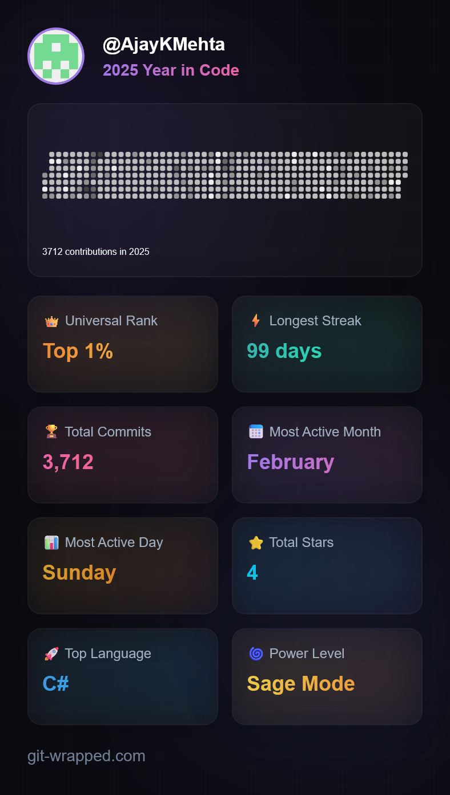
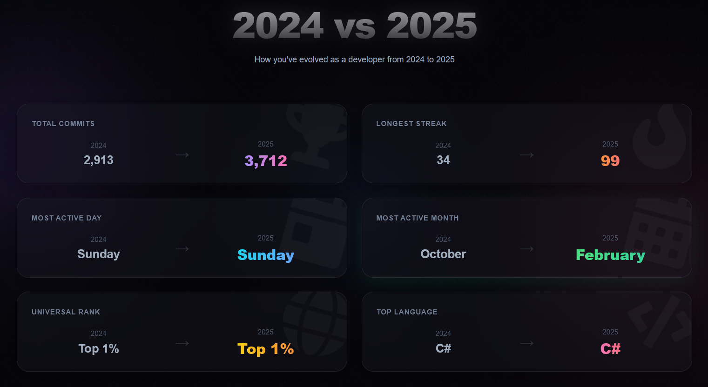

:construction: **WORK IN PROGRESS** :construction:

**Hi there 👋, I'm Ajay.**

## Stats

<picture>
  <source
    srcset="https://github.com/AjayKMehta/AjayKMehta/blob/master/img/stats-dark.svg"
    media="(prefers-color-scheme: dark)"
  />
  <source
    srcset="https://github.com/AjayKMehta/AjayKMehta/blob/master/img/stats-default.svg"
    media="(prefers-color-scheme: light), (prefers-color-scheme: no-preference)"
  />
  
</picture>

### 2025

## Skills and interests

### Languages

    
    <!---->

### :cloud:

### Data

### Other

## Recent activity

<!--START_SECTION:activity-->
1. 🚀 Committed to master in [AjayKMehta/Dappery](https://github.com/AjayKMehta/Dappery/commit/db4e831432fd202b953ba483255d58e9b3e127b7)
2. 🚀 Committed to main in [AjayKMehta/dotfiles](https://github.com/AjayKMehta/dotfiles/commit/31e1c9f0c53dc50fde10bb97e868256bf779a3a3)
3. 🚀 Committed to main in [AjayKMehta/dotfiles](https://github.com/AjayKMehta/dotfiles/commit/8373beb563a2e316412d735bffda01f942f41e21)
4. 🚀 Committed to main in [AjayKMehta/dotfiles](https://github.com/AjayKMehta/dotfiles/commit/69100d42f4149fb8897bbcb8a45d9c6bb1d412f7)
5. 🚀 Committed to master in [AjayKMehta/Dappery](https://github.com/AjayKMehta/Dappery/commit/f18951edf0583a2f43efeff923d95b21ba08a92e)
6. 🚀 Committed to main in [AjayKMehta/WSL](https://github.com/AjayKMehta/WSL/commit/90081359b9692808f687e002e920e9850c38b92e)
7. 🚀 Committed to master in [AjayKMehta/Dappery](https://github.com/AjayKMehta/Dappery/commit/71d2b43d5b12ccf879641a8f58f65b021dd7b095)
8. ✔️ Merged PR #512 in [AjayKMehta/Dappery](https://github.com/AjayKMehta/Dappery/pull/512)
9. 🚀 Committed to codeql-workflow-improvements in [AjayKMehta/Dappery](https://github.com/AjayKMehta/Dappery/commit/bc5aef01cf6a5e3178d4ad8810d05a5ec2803042)
10. 🔀 Opened PR #512 in [AjayKMehta/Dappery](https://github.com/AjayKMehta/Dappery/pull/512)
11. ✨ Created a new branch codeql-workflow-improvements in [AjayKMehta/Dappery](https://github.com/AjayKMehta/Dappery/tree/codeql-workflow-improvements)
12. 🔎 Created PR #510 in [AjayKMehta/Dappery](https://github.com/AjayKMehta/Dappery/pull/510#pullrequestreview-4705064996)
13. 🔎 Created PR #31 in [AjayKMehta/template-dotnet](https://github.com/AjayKMehta/template-dotnet/pull/31#pullrequestreview-4705049257)
14. 🚀 Committed to main in [AjayKMehta/template-dotnet](https://github.com/AjayKMehta/template-dotnet/commit/d41b105edb2366bbb9720d77bd1ee5e44f798a60)
15. 🚀 Committed to master in [AjayKMehta/PowerShellScripts](https://github.com/AjayKMehta/PowerShellScripts/commit/a3ae7af744158f6077472b12b944184515d989cb)
<!--END_SECTION:activity-->

> [!NOTE]
> This includes activity for public repos *only*.
