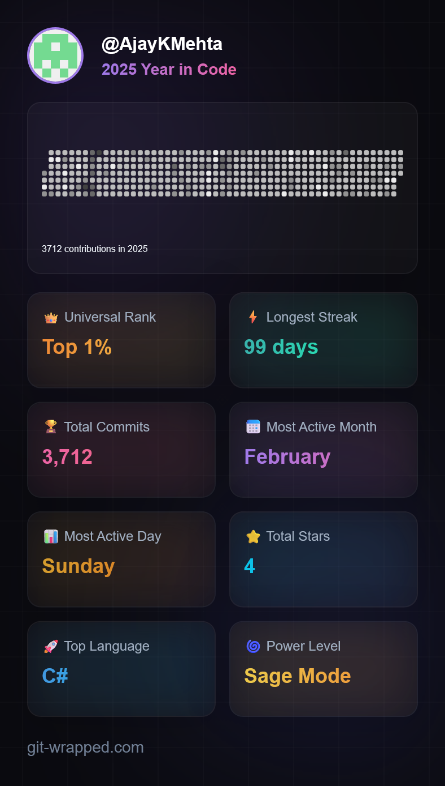
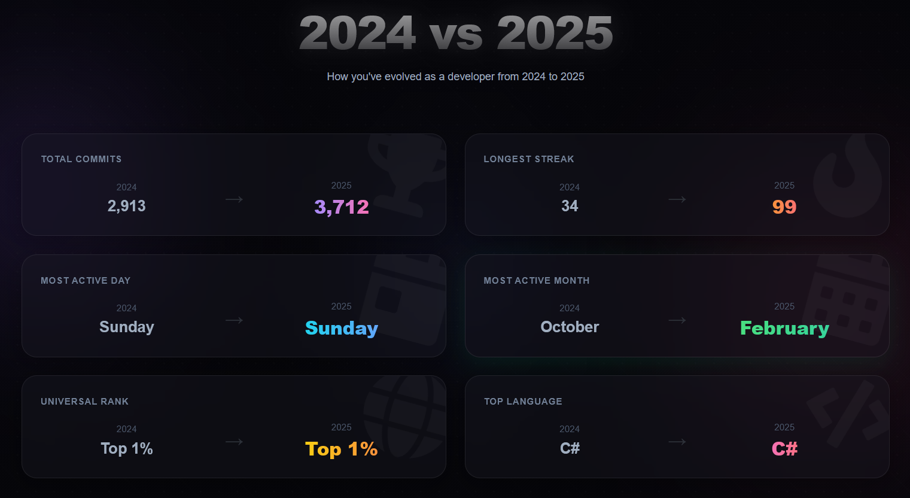

:construction: **WORK IN PROGRESS** :construction:

**Hi there 👋, I'm Ajay.**

## Stats

<picture>
  <source
    srcset="https://github.com/AjayKMehta/AjayKMehta/blob/master/img/stats-dark.svg"
    media="(prefers-color-scheme: dark)"
  />
  <source
    srcset="https://github.com/AjayKMehta/AjayKMehta/blob/master/img/stats-default.svg"
    media="(prefers-color-scheme: light), (prefers-color-scheme: no-preference)"
  />
  
</picture>

### 2025

## Skills and interests

### Languages

    
    <!---->

### :cloud:

### Data

### Other

## Recent activity

<!--START_SECTION:activity-->
1. 🚀 Committed to main in [AjayKMehta/WSL](https://github.com/AjayKMehta/WSL/commit/ee92e3769dcd12955a3986cff783733a88603ec2)
2. 🚀 Committed to main in [AjayKMehta/setup-machine](https://github.com/AjayKMehta/setup-machine/commit/c853bd6bf847d94c73ebc60e0c6821838b5fcb96)
3. 🚀 Committed to main in [AjayKMehta/WSL](https://github.com/AjayKMehta/WSL/commit/519179fa5fa302a5205a826dd41bd48cf233e070)
4. 🚀 Committed to main in [AjayKMehta/dotfiles](https://github.com/AjayKMehta/dotfiles/commit/3bf35629d8f1d395a4f47b0d2962f2ceccb83926)
5. 🚀 Committed to main in [AjayKMehta/WSL](https://github.com/AjayKMehta/WSL/commit/03bb8146d99fbfb03b9884cb66ecf2498df5b897)
6. 🚀 Committed to main in [AjayKMehta/WSL](https://github.com/AjayKMehta/WSL/commit/bb11a731e3bb40d34b62ae54d896bc817a3d2fed)
7. 🚀 Committed to main in [AjayKMehta/WSL](https://github.com/AjayKMehta/WSL/commit/6dd1c4e971b3b271bb8ca432cfd8f04da3c97a8d)
8. 🚀 Committed to main in [AjayKMehta/dotfiles](https://github.com/AjayKMehta/dotfiles/commit/e5efd8f1c9bf55e3b01782eccee4c66ab0c64ca7)
9. 🚀 Committed to main in [AjayKMehta/WSL](https://github.com/AjayKMehta/WSL/commit/1bba7a3940c79fee77bf43cbb0e9a56508d2050c)
10. 🚀 Committed to master in [AjayKMehta/Dappery](https://github.com/AjayKMehta/Dappery/commit/a91171520cc795ce814caa97739ecc1f26a9ea6e)
11. 🚀 Committed to master in [AjayKMehta/builderbuilder](https://github.com/AjayKMehta/builderbuilder/commit/7470f2ab301489638caee14587395d0e9396a66c)
12. 🚀 Committed to main in [AjayKMehta/setup-machine](https://github.com/AjayKMehta/setup-machine/commit/8024a6ecf97f5ecb916c05084b87e8a3cd1c1cd8)
13. 🚀 Committed to main in [AjayKMehta/dotfiles](https://github.com/AjayKMehta/dotfiles/commit/7bc3d5ce4c69d832b336138eca7d6349a8987c3c)
14. 🚀 Committed to main in [AjayKMehta/template-dotnet](https://github.com/AjayKMehta/template-dotnet/commit/81b44d9a0ccdbf2df2f20b526cd18ee48b3798ca)
15. 🚀 Committed to main in [AjayKMehta/setup-machine](https://github.com/AjayKMehta/setup-machine/commit/61ee36ac5a644d9f1f4b058d4aaa280364278be2)
<!--END_SECTION:activity-->

> [!NOTE]
> This includes activity for public repos *only*.
